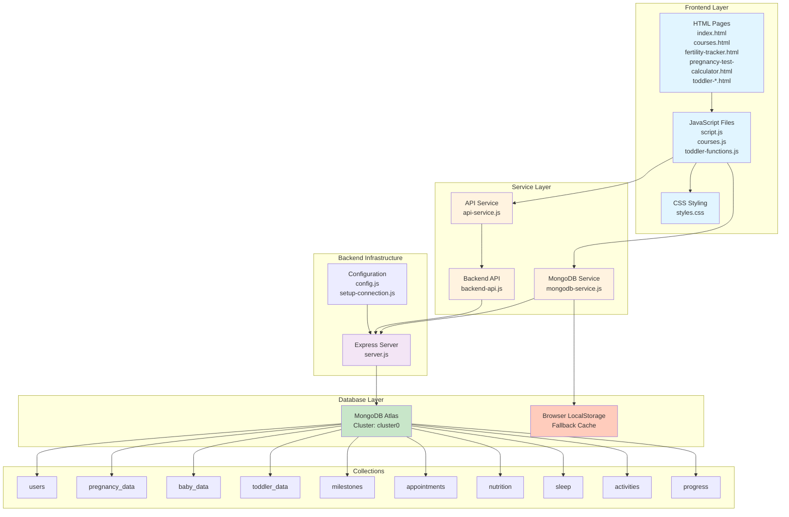
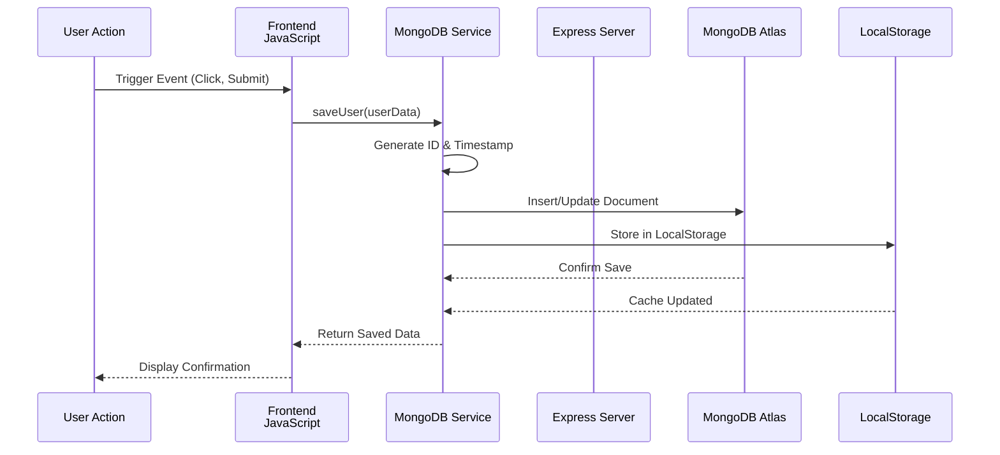
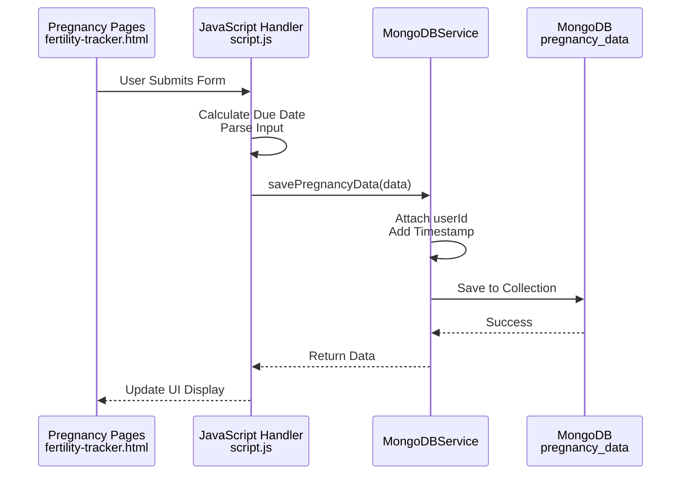
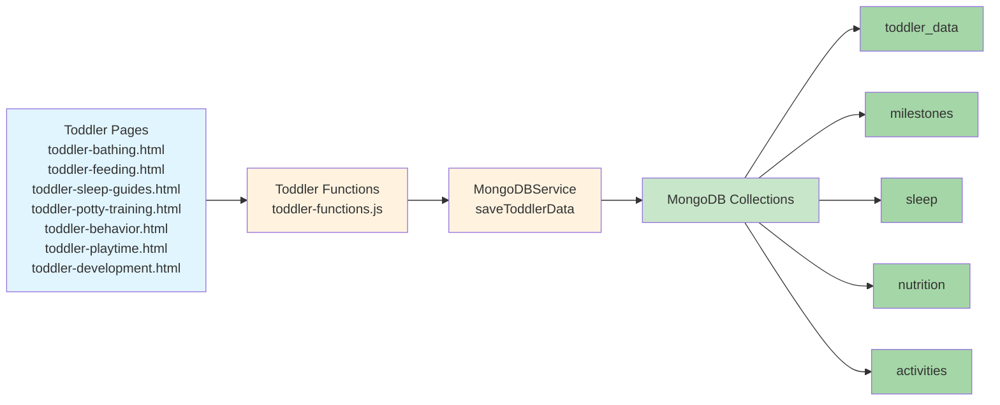
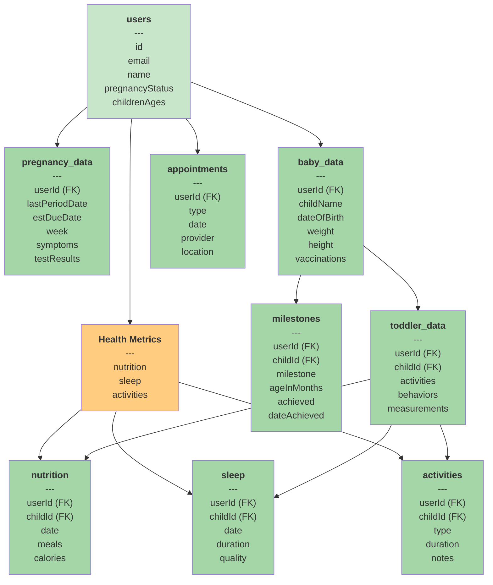
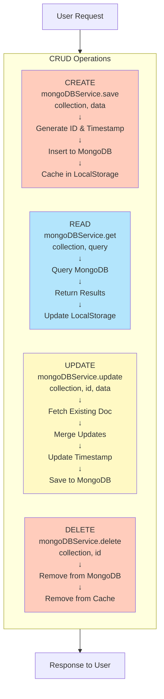
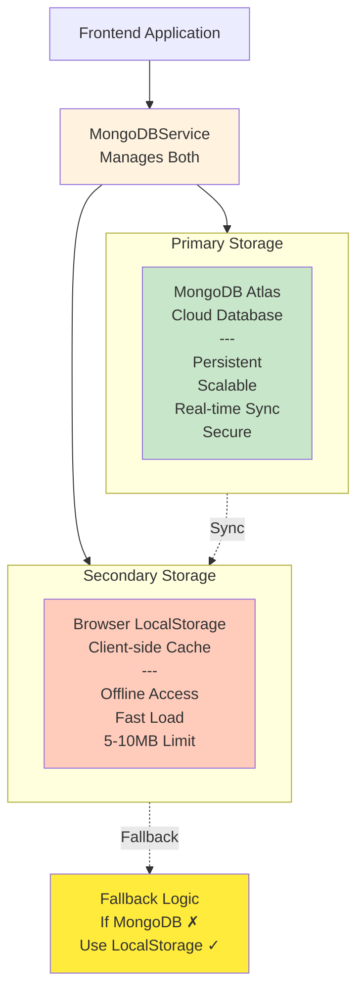
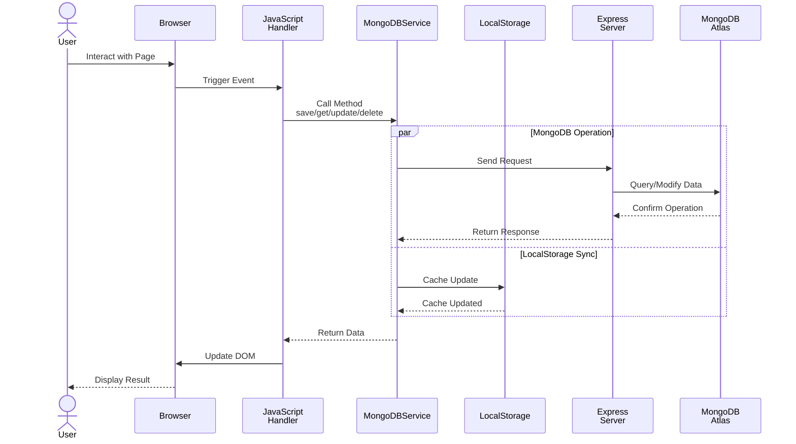
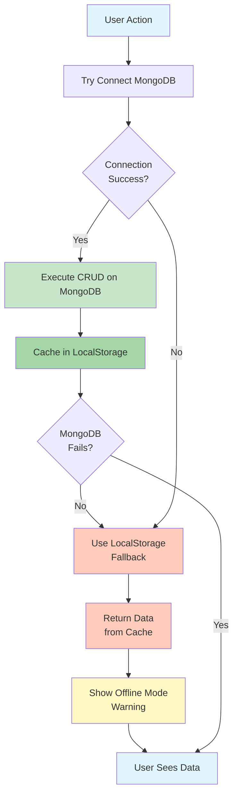

# MamaSafe Database Data Flow Diagrams

This document contains visual diagrams of the database architecture and data flows for the MamaSafe application.

## 1. System Architecture Overview

## 2. User Data Flow

## 3. Pregnancy Tracking Data Flow

## 4. Toddler Data Management Flow

## 5. Database Collection Relationships

## 6. CRUD Operations Flow

## 7. Data Storage Layer - Dual Architecture

## 8. Complete Request-Response Cycle

## 9. MongoDB Collections Overview

| Collection | Purpose | Key Fields | Relations |
|---|---|---|---|
| **users** | User profiles and preferences | id, email, name, pregnancyStatus | Parent for all user data |
| **pregnancy_data** | Pregnancy tracking info | userId, lastPeriodDate, estDueDate, week | References users |
| **baby_data** | Baby/infant information | userId, childName, dateOfBirth, vaccinations | References users, parent for toddler data |
| **toddler_data** | Toddler activities & milestones | userId, childId, activities, behaviors | References users & baby_data |
| **milestones** | Child development milestones | userId, childId, milestone, achieved | References users & baby_data |
| **appointments** | Medical appointments | userId, type, date, provider, location | References users |
| **nutrition** | Feeding & nutrition logs | userId, childId, date, meals, calories | References users & baby_data |
| **sleep** | Sleep tracking data | userId, childId, date, duration, quality | References users & baby_data |
| **activities** | Activity & play logs | userId, childId, type, duration | References users & baby_data |
| **progress** | Overall progress tracking | userId, metrics, updates | References users |

## 10. Error Handling & Fallback Flow

---

## Configuration Details

### MongoDB Atlas Connection
- **Host**: `cluster0.ofrzq1d.mongodb.net`
- **Database**: `mamacare`
- **Username**: `ug2424887_db_user`
- **Connection Options**:
  - Retry writes: enabled
  - Write concern: majority
  - Pool size: 10
  - Selection timeout: 5000ms

### API Endpoints
- Base URL: `http://localhost:3000`
- Health Check: `/api/health`
- User endpoints: `/api/users/*`
- Data endpoints: `/api/[collection]/*`

### Environment Configuration
See `config.js` and `.env` for connection settings.

---

**Last Updated**: May 21, 2026
