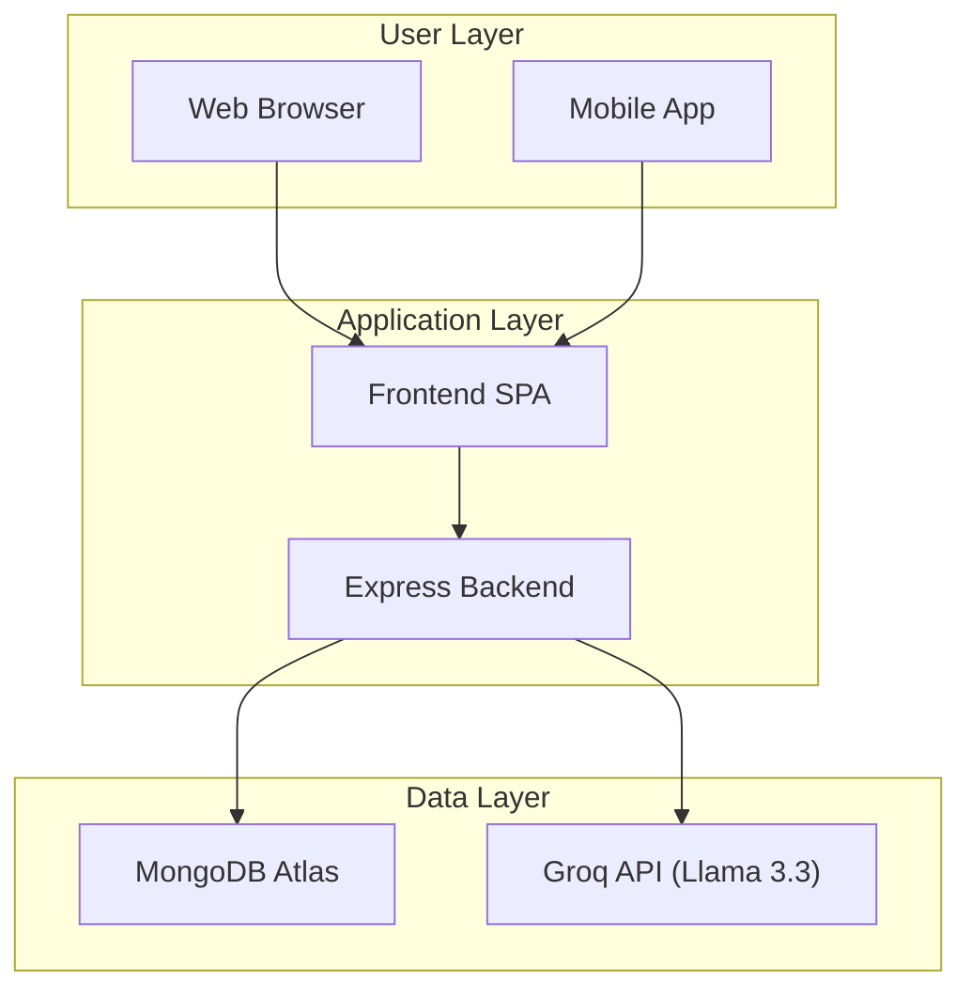
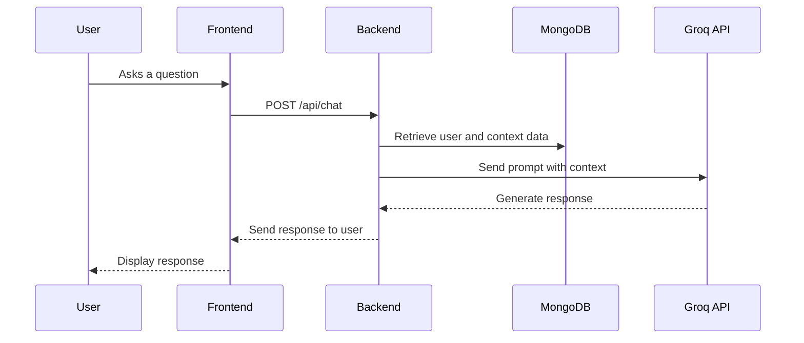

# Chapter 1: Introduction

## 1.1. Background and Motivation

The journey of pregnancy and early parenthood is a transformative experience, yet it is often accompanied by a myriad of questions and uncertainties. In the digital age, expectant and new parents are inundated with information, much of which is conflicting, overwhelming, or unreliable. This information overload can lead to a confidence gap, causing stress and anxiety at a time that should be joyous.

The MamaCare project is born out of a desire to address these challenges. It is an AI-powered health platform designed to serve as a comprehensive companion for parents, from preconception to toddlerhood. The core mission of MamaCare is to empower parents with a single, reliable source of personalized guidance, interactive tools, and educational resources. By leveraging the power of artificial intelligence, MamaCare aims to provide a supportive and easy-to-use platform that delivers accurate, accessible, and timely health information, 24/7.

## 1.2. Problem Statement

Expectant and new parents face significant challenges when navigating pregnancy and early parenting. The primary problems identified are:

1.  **Information Overload:** The internet is saturated with conflicting, overwhelming, and often unreliable advice on pregnancy and parenting.
2.  **Limited 24/7 Access:** Personalized guidance from healthcare providers is not available around the clock, leaving parents to navigate urgent concerns alone.
3.  **Fragmented Tools:** Essential tools for pregnancy tracking, baby name brainstorming, educational courses, and health-related chat are often scattered across multiple, disconnected applications.
4.  **Lack of Personalization:** Most available advice is generic and fails to adapt to an individual's specific stage of pregnancy, health history, or personal concerns.
5.  **Confidence Gap:** New parents often feel uncertain about their decisions, which can lead to significant stress and anxiety.

MamaCare directly addresses these issues by offering a unified, AI-powered platform that provides personalized, accessible, and trusted guidance whenever it is needed.

## 1.3. Project Aims and Objectives

The primary aim of the MamaCare project is to develop a comprehensive, AI-powered health platform that supports expectant and new parents. The following objectives have been established to achieve this aim:

*   To design and implement a centralized platform that integrates a variety of tools, including pregnancy tracking, educational courses, and a baby name generator.
*   To develop an AI-powered chatbot that provides personalized, evidence-based answers to health-related questions 24/7.
*   To create a system that can deliver personalized content and advice based on the user's specific stage of pregnancy or parenthood.
*   To build a user-friendly and intuitive interface for both web and mobile platforms.
*   To ensure the information provided is reliable by drawing from trusted sources and clearly stating that the AI is not a substitute for professional medical advice.

## 1.4. Scope and Limitations

The scope of the MamaCare project encompasses the development of a web and mobile application with a Node.js backend and a MongoDB database. The core features include an AI chatbot powered by the Llama 3.3 Large Language Model, personalized content delivery, and various tools for parents.

The primary limitation of this project is that the AI-powered chatbot, while advanced, is not a substitute for professional medical advice. The platform is intended to be an informational and supportive tool, and users will be advised to consult with a healthcare professional for any medical concerns. Additionally, the initial version of the mobile application is developed using React Native, and its functionality may be a subset of the web platform.

## 1.5. Dissertation Structure

This dissertation is organized into five chapters:

*   **Chapter 1: Introduction** provides the background and motivation for the project, outlines the problem statement, and defines the project's aims, objectives, scope, and limitations.
*   **Chapter 2: Literature Review** examines existing parental support applications, discusses the role of AI in healthcare, and reviews the technologies used in the project.
*   **Chapter 3: System Analysis and Design** details the system architecture, data models, UI/UX design, and the integration of the AI chatbot.
*   **Chapter 4: Implementation** describes the development of the backend, frontend, and mobile components of the platform, with a focus on the AI integration.
*   **Chapter 5: Testing and Evaluation** presents the testing strategies employed, analyzes the results, and discusses user feedback and potential future work.

# Chapter 2: Literature Review

## 2.1. Existing Parental Support Applications

The market for parental support applications is robust, with a variety of applications available to assist parents through the different stages of pregnancy and early childhood. These applications typically fall into several categories:

*   **Informational Apps:** Applications like *BabyCenter* and *What to Expect* provide a wealth of articles and information on pregnancy and baby development. They often include features like week-by-week pregnancy trackers and community forums where parents can connect and share advice.
*   **Social Networking Apps:** *Peanut* is a prominent example of a social networking app specifically for mothers. It allows users to connect with other mothers in their area, join groups, and share experiences and advice.
*   **Utility Apps:** This category includes apps like *The Wonder Weeks*, which tracks a baby's mental development leaps, and *Cozi Family Organizer*, which helps families manage schedules and to-do lists.

While these applications offer valuable resources, they often exist in isolation. A user might need one app to track their pregnancy, another to connect with other parents, and a third for managing family tasks. This fragmentation can be inconvenient and lead to a disjointed user experience. MamaCare aims to address this by providing an integrated platform that combines many of these features into a single, cohesive application. Furthermore, the personalization in many of these apps is limited, and none offer the kind of 24/7, AI-powered conversational support that MamaCare provides.

## 2.2. The Role of AI in Healthcare

Artificial Intelligence (AI) is revolutionizing the healthcare industry, with applications ranging from diagnostics to personalized treatment and patient engagement. AI's ability to analyze vast amounts of data and identify patterns that may be invisible to the human eye has led to significant advancements in various medical fields.

*   **Diagnosis and Detection:** AI algorithms, particularly deep learning models, are being used to analyze medical images such as X-rays and MRIs to detect diseases like cancer with remarkable accuracy.
*   **Personalized Treatment:** AI can analyze a patient's genetic and lifestyle data to recommend personalized treatment plans, a field known as precision medicine.
*   **Drug Discovery:** AI is accelerating the process of drug discovery by identifying potential drug candidates and predicting their efficacy.
*   **Patient Engagement and Monitoring:** AI-powered applications are increasingly being used to provide personalized health coaching, monitor chronic conditions, and offer mental health support.

MamaCare aligns with this trend of using AI for patient engagement and support. By using a large language model, MamaCare can provide a conversational interface for users to ask questions and receive personalized information and support. This approach has the potential to make health information more accessible and engaging for users, and to provide a level of support that is not possible with traditional, static applications.

## 2.3. Technologies Used

The selection of technologies for the MamaCare project was guided by the need for a robust, scalable, and modern architecture. The following technologies were chosen:

*   **Node.js and Express:** Node.js was chosen for the backend due to its non-blocking, event-driven architecture, which makes it well-suited for building real-time applications like a chatbot. Express.js, a minimalist web framework for Node.js, provides a robust set of features for building the backend API.
*   **MongoDB:** A NoSQL database, MongoDB was chosen for its flexible data model, which is ideal for storing the a diverse and evolving data of a health application. Its scalability and performance are also key advantages.
*   **Vanilla JavaScript:** The frontend of the web application was built using vanilla JavaScript, HTML5, and CSS3. This choice was made to create a lightweight and fast-loading user experience without the overhead of a large frontend framework.
*   **React Native:** For the mobile application, React Native was chosen to enable cross-platform development for both iOS and Android from a single codebase. This approach reduces development time and effort while still providing a native-like user experience.
*   **Llama 3.3 and Retrieval-Augmented Generation (RAG):** The core of MamaCare's intelligence is the Llama 3.3 large language model, accessed via the Groq API. This state-of-the-art model provides the conversational capabilities of the chatbot. The system employs a Retrieval-Augmented Generation (RAG) architecture, which allows the AI to pull in relevant information from the application's database (such as the user's pregnancy week or health data) to provide more personalized and accurate responses.

# Chapter 3: System Analysis and Design

## 3.1. System Architecture

The MamaCare system is designed as a three-tier architecture, consisting of a frontend, a backend, and a database. The architecture is designed to be scalable and maintainable, with a clear separation of concerns between the different components.

*   **Frontend:** The frontend consists of a single-page application (SPA) for the web, and a React Native application for mobile. The web application is built with vanilla JavaScript, HTML, and CSS, and is responsible for rendering the user interface and communicating with the backend via a RESTful API. The mobile application provides a native-like experience for iOS and Android users.
*   **Backend:** The backend is a monolithic application built with Node.js and Express. It is responsible for handling all business logic, including user authentication, data processing, and communication with the database and the AI model. The backend exposes a RESTful API that is consumed by the frontend applications.
*   **Database:** The database is a MongoDB Atlas cluster, a cloud-hosted NoSQL database. It is used to store all application data, including user profiles, health data, and chat history.

The following diagram illustrates the high-level system architecture:



## 3.2. Data Modelling

The data model for MamaCare is designed to be flexible and scalable, using MongoDB's document-based structure. The data is organized into several collections, each serving a specific purpose.

The main collections are:

*   **User & App State:**
    *   `users`: Stores user account information, including name, email, and pregnancy stage.
    *   `pregnancies`: Contains records of active pregnancies, linked to the user.
    *   `pregnancy_data`: General information about pregnancy.
    *   `pregnancy_weeks`: Detailed week-by-week pregnancy information.
*   **AI Chat & History:**
    *   `chatHistory`: Stores complete chat logs between users and the AI.
    *   `chat_sessions`: Manages individual chat sessions.
*   **Health & Medical Data:**
    *   `pregnancy_vital_assessments`: Stores vital signs like blood pressure and heart rate.
    *   `maternal_health_risk_records`: Contains risk assessment records.
    *   `danger_signs`: A list of pregnancy danger signs used for safety overrides.
    *   `symptoms`, `nutrition`, `sleep`: Collections for tracking user-inputted health data.
*   **Educational & Reference Content:**
    *   `articles`, `faqs`, `who_guidelines`: Content used to provide information to the user and as a knowledge base for the AI.
    *   `who_document_chunks`: Chunked documents for the RAG system.
*   **Reminders, Appointments & Activities:**
    *   `reminders`, `appointments`, `notifications`, `activities`: Collections for managing user-related events and logs.

## 3.3. UI/UX Design

The user interface of MamaCare is designed to be clean, intuitive, and reassuring for expectant and new parents. The design is focused on ease of use, with a clear and simple navigation structure.

*   **Home Dashboard (`index.html`):** The main entry point of the application, the dashboard provides a central hub for all features. It displays personalized information based on the user's stage of pregnancy and provides quick access to tools, the AI chat, courses, and other resources.
*   **Pregnancy Section (`pregnancy-advanced.html`):** This section offers advanced pregnancy tracking, with week-by-week information, symptom tracking, and tips.
*   **Courses (`courses.html`):** The courses section provides structured learning modules on various topics related to pregnancy and parenting.
*   **AI Chat (`chat.html`, `health-chatbot.html`):** The chat interface is a key feature of the application. It is designed to be a simple, conversational interface where users can ask questions and receive answers from the AI chatbot.
*   **Authentication (`auth.html`):** The application provides a simple and secure authentication system, with options for Google OAuth or guest mode.

## 3.4. AI Chatbot Design and Integration

The AI chatbot is a core component of the MamaCare platform. It is designed to provide personalized, conversational support to users 24/7. The chatbot is powered by the Llama 3.3 large language model, accessed via the Groq API, and uses a Retrieval-Augmented Generation (RAG) architecture.

The RAG architecture allows the chatbot to provide more accurate and context-aware responses by retrieving relevant information from the application's database before generating a response. When a user asks a question, the system works as follows:

1.  **Context Retrieval:** The backend retrieves relevant information from the MongoDB database, such as the user's profile, health data, and the current week of pregnancy.
2.  **Prompt Engineering:** This information is then used to construct a detailed prompt that is sent to the Llama 3.3 model.
3.  **Response Generation:** The Llama 3.3 model generates a response based on the prompt, which is then sent back to the user.

This approach allows the chatbot to provide personalized advice and information that is tailored to the user's specific situation. For example, if a user asks a question about a symptom, the chatbot can take into account their stage of pregnancy and any pre-existing health conditions.

The chat flow is illustrated in the sequence diagram below:



# Chapter 4: Implementation

## 4.1. Backend Development

The backend of the MamaCare platform is a monolithic application developed with Node.js and the Express.js framework. The choice of a monolithic architecture, while less fashionable than microservices, was a pragmatic one for this project, allowing for rapid development and simplified deployment. The entire backend logic is contained within a single `server.js` file, which is responsible for everything from server configuration to API routing.

### 4.1.1. Server Setup and Middleware

The `server.js` file begins by importing the necessary dependencies, including `express`, `cors`, `helmet`, and the `mongodb` driver. It then sets up the Express application, configures middleware for security and performance, and establishes the connection to the MongoDB database.

Key middleware used in the application includes:

*   `helmet`: For securing the application by setting various HTTP headers.
*   `cors`: For enabling Cross-Origin Resource Sharing, allowing the frontend to make requests to the backend.
*   `compression`: For compressing HTTP responses to improve performance.
*   `morgan`: For logging HTTP requests.
*   `express.json`: For parsing JSON request bodies.

### 4.1.2. API Routes

The backend exposes a RESTful API for the frontend applications to consume. The routes are organized by functionality, with a dedicated `chatRoutes.js` file for all chat-related endpoints. The main `server.js` file also contains a large number of routes for other features, such as user authentication, data retrieval, and admin functions.

An example of a route definition from `chatRoutes.js` is shown below:

```javascript
// mamasafe/backend/routes/chatRoutes.js

const express = require('express');
const { createChatController } = require('../controllers/chatController');

function createChatRoutes(dependencies = {}) {
    const router = express.Router();
    const controller = createChatController(dependencies);
    const checkDbConnection = dependencies.checkDbConnection || ((req, res, next) => next());

    router.post('/', checkDbConnection, controller.chat);
    // ... other routes
    return router;
}
```

This modular approach to routing, even within a monolithic architecture, helps to keep the code organized and maintainable.

### 4.1.3. Database Integration

The backend is responsible for all interactions with the MongoDB database. The `server.js` file contains the logic for connecting to the database, as well as functions for performing CRUD (Create, Read, Update, Delete) operations on the various collections. The application is designed to be resilient, with a fallback to an in-memory database if the connection to MongoDB fails.

## 4.2. Frontend Web Development

The frontend of the MamaCare web application is a single-page application (SPA) built with vanilla JavaScript, HTML, and CSS. This approach was chosen to create a fast and lightweight user experience. The frontend code is located in the `mamasafe/frontend` directory.

The UI is composed of several HTML files, each representing a different page or section of the application. The main entry point is `index.html`, which serves as the dashboard. The application's logic is primarily contained in the `script-new.js` file, which is responsible for handling user interactions, making API calls to the backend, and updating the DOM.

## 4.3. Mobile App Development

The MamaCare mobile application is developed using React Native, a cross-platform framework that allows for the creation of native-like apps for both iOS and Android from a single codebase. The code for the mobile app is located in the `mamacare-mobile` directory.

The `package.json` file in this directory lists the project's dependencies, which include `react`, `react-native`, and various other libraries for navigation, UI components, and device hardware access. The application is structured into components, screens, and services, following best practices for React Native development.

## 4.4. AI Model Integration

The integration with the Llama 3.3 AI model is a key feature of the MamaCare platform. The backend communicates with the model via the Groq API. The logic for this integration is located in the `mamasafe/backend/services` directory.

When a user sends a message to the chatbot, the backend's `processHealthQuery` function is called. This function is responsible for:

1.  Retrieving the user's context from the database.
2.  Constructing a prompt for the AI model.
3.  Sending the prompt to the Groq API.
4.  Receiving the response from the AI model.
5.  Saving the chat history to the database.

The use of a Retrieval-Augmented Generation (RAG) architecture allows the AI to provide highly personalized and contextually relevant responses.

# Chapter 5: Testing and Evaluation

## 5.1. Testing Strategies

The testing strategy for the MamaCare project is multifaceted, incorporating a combination of automated checks and manual testing procedures to ensure the quality and reliability of the platform.

### 5.1.1. Current Testing Practices

The project currently employs the following testing practices:

*   **Syntax Checking:** A continuous integration (CI) check is in place (`scripts/ci-check.js`) that performs a syntax check on a predefined list of critical JavaScript files. This provides a baseline level of quality control by ensuring that the code is syntactically correct.
*   **Ad-hoc Feature Testing:** The `mamasafe/backend` directory contains a large number of `test-*.js` and `test_*.py` files. These scripts are used for ad-hoc testing of specific features and integrations, such as the AI services (Groq, Gemini), the database, and various API endpoints.
*   **Linting:** The `mamacare-mobile` application uses ESLint to enforce code quality and consistency in the React Native codebase.

### 5.1.2. Proposed Testing Strategy

To further improve the quality of the application, a more comprehensive and automated testing strategy is proposed:

*   **Unit Testing:** A unit testing framework such as Jest or Mocha should be implemented to test individual functions and components in isolation. This will help to ensure that each part of the application works as expected.
*   **Integration Testing:** An integration testing suite should be developed to test the interaction between different parts of the system. For example, integration tests could be written to verify that the backend API correctly communicates with the MongoDB database.
*   **End-to-End (E2E) Testing:** An E2E testing framework like Cypress or Playwright should be used to test the application from the user's perspective. E2E tests would simulate user interactions with the application, such as signing up, logging in, and using the chatbot.

## 5.2. Test Results and Analysis

This section would typically present the results of the testing activities described above. This would include metrics such as code coverage, the number of bugs found and fixed, and the performance of the application under various load conditions. The expected outcome of a comprehensive testing strategy is a high-quality, reliable, and performant application that meets the needs of its users.

## 5.3. User Feedback and Evaluation

Gathering user feedback is crucial for the success of any application. The following methods are proposed for evaluating the MamaCare platform:

*   **Surveys:** Online surveys can be used to gather quantitative feedback from a large number of users. The surveys could ask users to rate their satisfaction with the application, the quality of the AI's responses, and the usefulness of the various features.
*   **User Interviews:** One-on-one interviews with a smaller group of users can provide more in-depth qualitative feedback. These interviews can be used to understand the user's experience in more detail and to identify areas for improvement.
*   **Usability Testing:** Observing users as they interact with the application can help to identify usability issues that may not be apparent from surveys or interviews.

## 5.4. Future Work and Improvements

The MamaCare project has the potential for significant future development. The following are some of the key areas that could be improved in future iterations of the project:

*   **Backend Refactoring:** The current monolithic backend could be refactored into a more scalable and maintainable microservices architecture. This would allow for independent development and deployment of different parts of the application.
*   **UI/UX Enhancements:** The user interface of the web application could be improved by using a modern frontend framework such as React or Vue.js. This would allow for the creation of a more dynamic and interactive user experience.
*   **Formalize Testing:** The implementation of a comprehensive, automated testing suite, as proposed in section 5.1.2, would significantly improve the quality and reliability of the application.
*   **Feature Expansion:** There are many potential new features that could be added to the MamaCare platform, such as:
    *   Video consultations with healthcare providers.
    *   A more advanced community forum with features like private messaging and user groups.
    *   Integration with wearable health devices to automatically track health data.
    *   Support for multiple languages.
    *   A more advanced AI that can understand and respond to voice commands.
