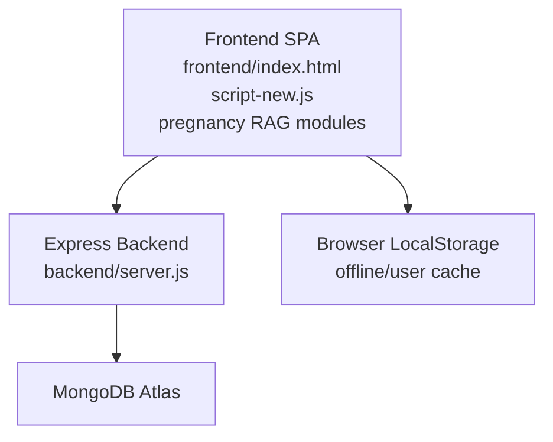
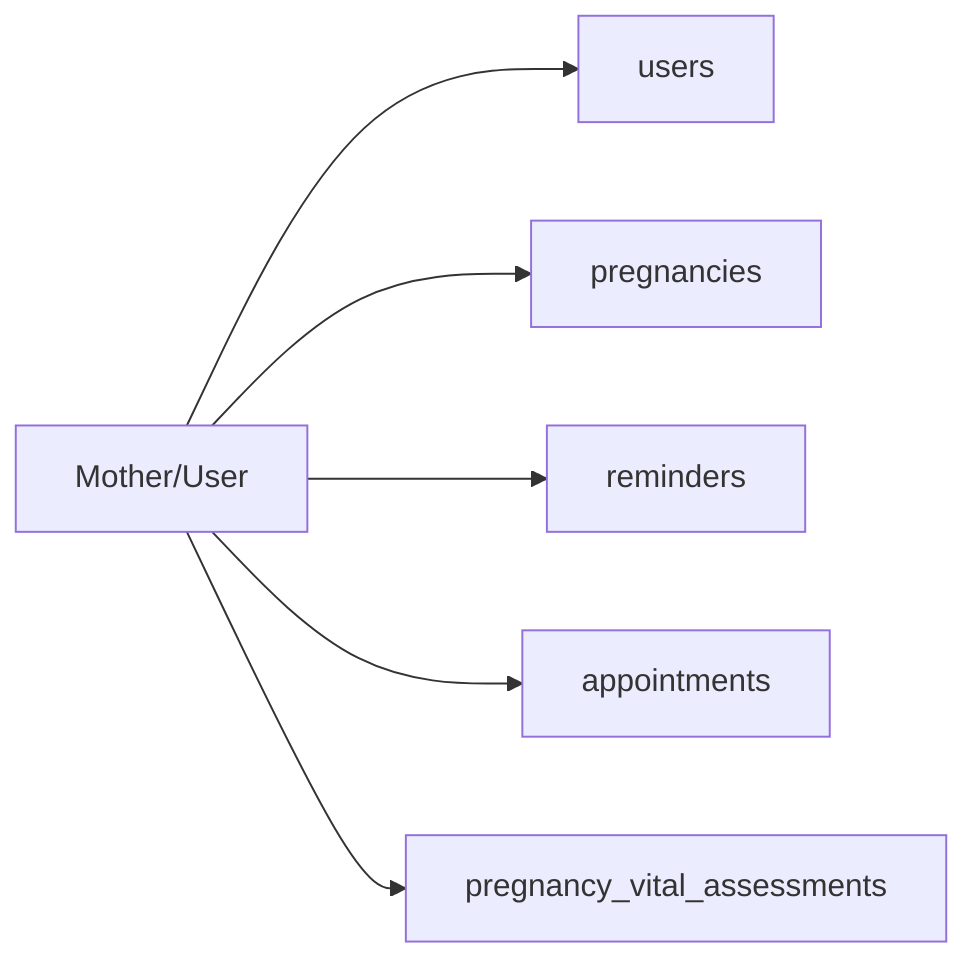
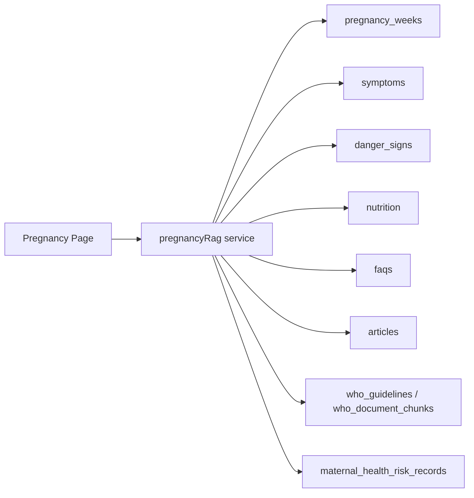
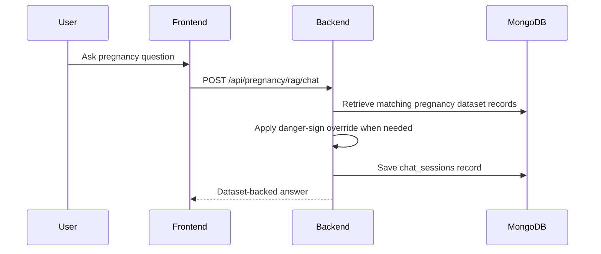
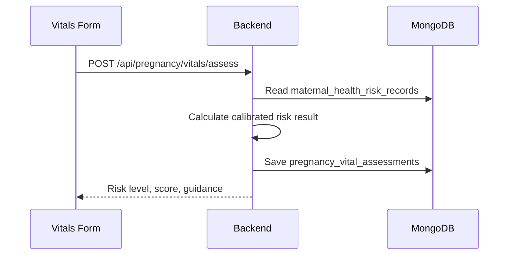

# MamaSafe Database Data Flow

This document describes the current pregnancy-focused data flow after older preconception and child-development modules were removed.

## System Overview

## Personal Pregnancy Layer

The personal layer stores account identity, pregnancy profile, due date/week, reminders, appointments, and saved vital-risk assessments.

## Dataset Layer

The pregnancy page uses MongoDB dataset records for risk support, safety overrides, and educational answers.

## Chat Flow

## Risk Assessment Flow

Retired preconception and child-development collections and routes are no longer part of the active data flow.
